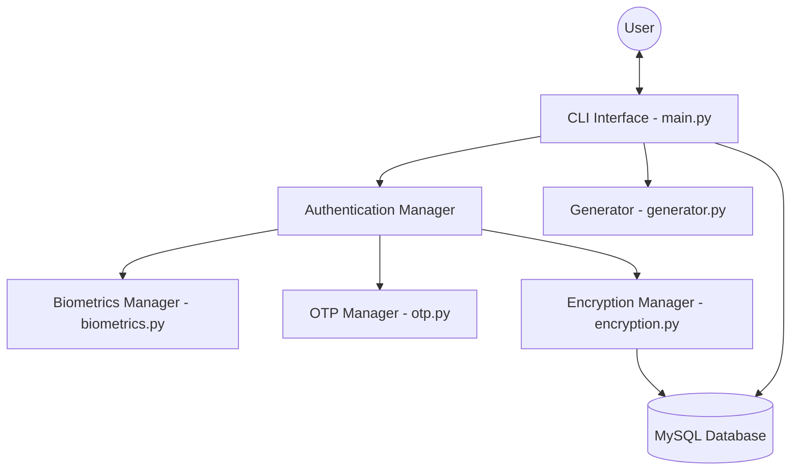
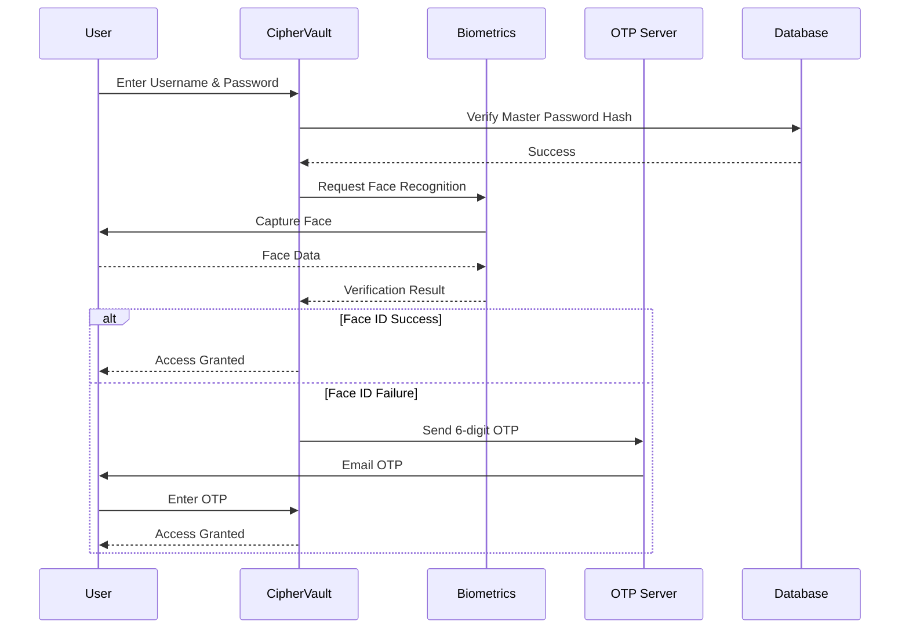

# CipherVault

CipherVault is a robust, multi-layered password management system designed with a strong focus on security and user privacy. It combines traditional master password protection with advanced biometric authentication and two-factor authentication (2FA) via email OTP to ensure that your sensitive credentials remain accessible only to you.

## Architecture Overview

CipherVault is built using a modular Python architecture, leveraging a MySQL backend for persistent storage.



## Authentication Flow

CipherVault employs a three-step authentication process for maximum security:

1.  **Master Credentials**: Username and Master Password.
2.  **Face ID**: Biometric verification using the system's camera.
3.  **Email OTP**: A secondary verification step if biometrics fail or during account setup.



## Key Features

- **Multi-Factor Authentication**: Combines something you know (password), something you are (biometrics), and something you have (email access).
- **Secure Storage**: All credential passwords are encrypted using AES-256 before being stored in the database.
- **Biometric Integration**: Uses `face_recognition` and `dlib` for local biometric processing.
- **Credential Generation**: Securely generate random, memorable usernames and complex passwords.
- **Rich CLI**: A user-friendly terminal interface powered by the `rich` library.
- **Account Management**: Full CRUD operations for stored credentials and the ability to wipe the entire master account.

## Security Implementation

### Encryption
- **Master Password**: Hashed using `bcrypt` with a unique salt to protect against rainbow table attacks.
- **Stored Credentials**: Encrypted using AES-256 in CBC (Cipher Block Chaining) mode. A SHA-256 hash of the master password is used as the encryption key.

### Biometrics
- Face data is captured and stored locally as image files.
- During authentication, the system performs a real-time comparison between the live camera feed and the registered face data.

### Two-Factor Authentication (2FA)
- Implements an email-based OTP system using `yagmail`.
- A unique 6-digit code is generated for each session and must be verified to gain access.

## Project Structure

- `CipherVault/main.py`: Entry point and CLI orchestration.
- `CipherVault/biometrics.py`: Biometric registration and recognition logic.
- `CipherVault/database.py`: MySQL database schema management and queries.
- `CipherVault/encryption.py`: Encryption and hashing utilities.
- `CipherVault/generator.py`: Password and username generation.
- `CipherVault/otp.py`: Email OTP delivery service.
- `CipherVault/data/`: Stores biometric data and wordlists for generation.

## Setup Instructions

### Prerequisites
- Python 3.12+
- MySQL Server
- Poetry (for dependency management)
- C++ Build Tools (required for `dlib` and `face-recognition`)

### Installation

1.  **Clone the repository**:
    ```bash
    git clone https://github.com/yourusername/CipherVault.git
    cd CipherVault
    ```

2.  **Install dependencies**:
    ```bash
    poetry install
    ```

3.  **Database Configuration**:
    Ensure your MySQL server is running. CipherVault expects a user with appropriate permissions. You can modify the database connection string in `CipherVault/main.py`.

4.  **Run the application**:
    ```bash
    poetry run python CipherVault/main.py
    ```

## Usage

Follow the on-screen prompts to:
1.  **Signup**: Create a master account, register your face, and verify your email.
2.  **Login**: Authenticate using your master password and biometrics.
3.  **Manage Credentials**:
    - Press `1` to add a new credential.
    - Press `2` to list all entries.
    - Press `3` to decrypt and view a specific password.
    - Press `4` to update an entry.
    - Press `5` to delete an entry.
    - Press `6` to wipe your account.